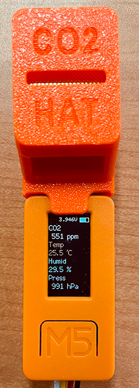
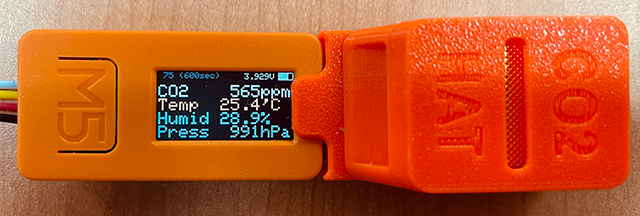

# m5stickc-environ-monitor

[M5StickC](https://m5stack-store.myshopify.com/collections/m5-core/products/stick-c) に、
[M5StickC/Plus用「Co2 HAT（ソケット版）」](https://kitto-yakudatsu.com/archives/7766) と
[ENV II Unit with Temperature Humidity Environment Sensor (SHT30+BMP280)](https://m5stack-store.myshopify.com/products/env-ii-unit)
を接続して、以下を測定し画面表示します。

* CO2濃度(ppm)
* 気温(℃)
* 湿度(%)
* 気圧(hPa)

以下の機能があります。

* 本体を回転させると、その向きに応じて画面を回転します。
* 本体向かって右のボタン(電源ボタンではない方)を押すと、画面OFFになりディープスリープします。
* 10分無操作で、画面OFFになりディープスリープします。
  * `M5` ボタンを押すとタイマーの残り時間をリセットします。
* ディープスリープ状態で `M5` ボタンを押すと復帰します。

| 縦画面イメージ           | 横画面イメージ           |
| ------------------------ | ------------------------ |
|  |  |

## 参考にしたページ

* LCD
  * [M5StickCのDisplay周り解析 | Lang-ship](https://lang-ship.com/blog/work/m5stickc-display/)
  * [M5StickCのDisplay周り解析 その2 | Lang-ship](https://lang-ship.com/blog/work/m5stickc-display2/)
* Sleep
  * [スリープ - M5StickC非公式日本語リファレンス](https://lang-ship.com/reference/unofficial/M5StickC/System/Sleep/)
  * [ESP32のディープスリープを調べる | Lang-ship](https://lang-ship.com/blog/work/esp32-deep-sleep/)
* MPU6886
  * [M5StickCであそぶ 〜6軸センサを使う〜 | MUDAなことをしよう。](https://make-muda.net/2019/09/6932/)
* ENV II Unit
  * [M5Stackで「環境センサユニット ver.2（ENV II）」を使う - MSR合同会社](https://msr-r.net/m5stack-env2/)
* MH-Z19C
  * [GitHub - iquiw/m5stickc-co2-monitor: CO2 monitor, M5StickC+MH-Z19C](https://github.com/iquiw/m5stickc-co2-monitor)
